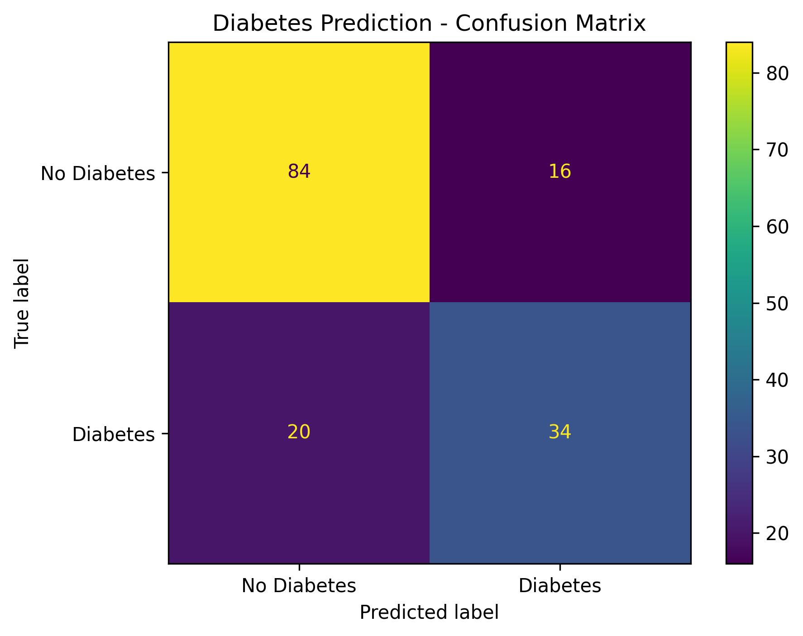
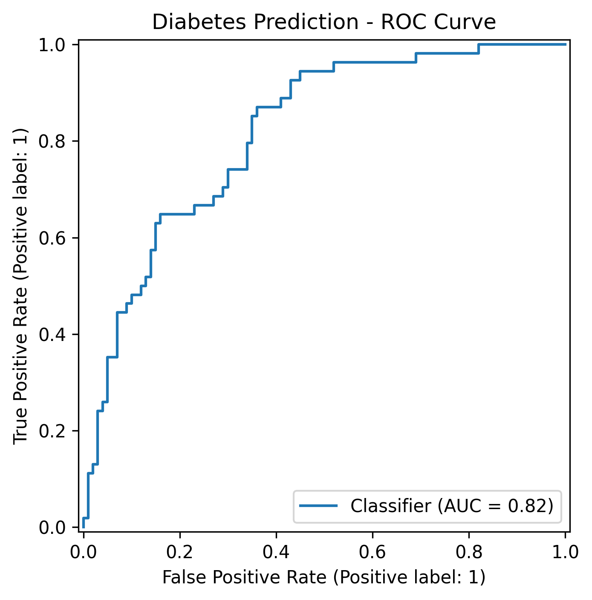

# Diabetes Prediction using Artificial Neural Network

An end-to-end machine learning project that uses an **Artificial Neural Network (ANN)** to classify diabetes outcomes from patient diagnostic measurements.

The project covers data inspection, preprocessing, feature standardization, neural network development, model evaluation, and visualization using Python and scikit-learn.

> **Note:** This project is intended for educational and machine-learning portfolio purposes. It is **not a clinical diagnostic tool**.

---

## Project Overview

Diabetes prediction is a binary classification problem where the objective is to predict whether a patient has a positive diabetes outcome based on a set of diagnostic measurements.

This project implements a Multilayer Perceptron classifier to learn patterns in the input features and classify observations into two categories:

- `0` — No diabetes
- `1` — Diabetes

The workflow is designed as a reproducible machine-learning pipeline, from loading the dataset to evaluating the trained model.

---

## Objectives

The main objectives of this project are to:

- Explore and inspect the dataset
- Check for missing values
- Examine the target-class distribution
- Separate features and target variables
- Split the data into training and testing sets
- Standardize numerical features
- Build an Artificial Neural Network classifier
- Evaluate classification performance
- Analyze the confusion matrix
- Evaluate discrimination using ROC-AUC
- Visualize model performance

---

## Dataset

The dataset contains **768 observations** and **8 predictive features**, plus the binary target variable `Outcome`.

### Features

| Feature | Description |
|---|---|
| `Pregnancies` | Number of pregnancies |
| `Glucose` | Plasma glucose concentration |
| `BloodPressure` | Diastolic blood pressure |
| `SkinThickness` | Triceps skin-fold thickness |
| `Insulin` | 2-Hour serum insulin |
| `BMI` | Body mass index |
| `DiabetesPedigreeFunction` | Diabetes pedigree function |
| `Age` | Age of the individual |
| `Outcome` | Target variable: 0 = No diabetes, 1 = Diabetes |

### Dataset Summary

- **Rows:** 768
- **Predictive features:** 8
- **Target variable:** `Outcome`
- **Class 0:** 500 observations
- **Class 1:** 268 observations
- **Missing values reported by pandas:** 0

The dataset is used as a machine-learning classification dataset and contains measurements commonly used in diabetes prediction exercises.

---

## Methodology

The project follows the following workflow:

```text
Raw Dataset
     │
     ▼
Data Inspection
     │
     ├── Dataset dimensions
     ├── Missing-value check
     └── Target distribution
     │
     ▼
Feature / Target Separation
     │
     ▼
Train-Test Split
     │
     ▼
Feature Standardization
     │
     ▼
Artificial Neural Network
     │
     ▼
Predictions
     │
     ├── Accuracy
     ├── Classification Report
     ├── Confusion Matrix
     └── ROC-AUC
```

### 1. Data Inspection

The dataset is loaded using pandas and inspected for:

- Dataset dimensions
- Missing values
- Target distribution

### 2. Train-Test Split

The dataset is divided into:

- **80% training data**
- **20% testing data**

A fixed random state is used to make the experiment reproducible.

Stratified splitting is applied to preserve the class distribution between the training and testing sets.

### 3. Feature Scaling

The input features are standardized using `StandardScaler`.

The scaler is fitted only on the training data and then applied to the test data to avoid data leakage.

### 4. Artificial Neural Network

The classification model is implemented using `MLPClassifier` from scikit-learn.

The architecture uses:

```text
Input Layer
     │
     ▼
Hidden Layer 1: 12 neurons
     │
     ▼
Hidden Layer 2: 8 neurons
     │
     ▼
Output: Binary Classification
```

Model configuration:

```python
MLPClassifier(
    hidden_layer_sizes=(12, 8),
    activation="relu",
    solver="adam",
    max_iter=500,
    random_state=42
)
```

---

## Model Performance

The final model was evaluated on **154 unseen test observations**.

### Overall Performance

| Metric | Result |
|---|---:|
| Accuracy | **76.62%** |
| ROC-AUC | **0.8161** |

### Classification Report

| Class | Precision | Recall | F1-Score | Support |
|---|---:|---:|---:|---:|
| No Diabetes (0) | 0.81 | 0.84 | 0.82 | 100 |
| Diabetes (1) | 0.68 | 0.63 | 0.65 | 54 |
| **Overall Accuracy** | | | **0.77** | **154** |
| Macro Average | 0.74 | 0.73 | 0.74 | 154 |
| Weighted Average | 0.76 | 0.77 | 0.76 | 154 |

### Confusion Matrix

```text
                 Predicted
              No Diabetes  Diabetes

Actual
No Diabetes       84          16
Diabetes          20          34
```

The model correctly classified:

- **84** observations as no diabetes
- **34** observations as diabetes

It incorrectly classified:

- **16** no-diabetes observations as diabetes
- **20** diabetes observations as no diabetes

---

## Visualizations

### Confusion Matrix



### ROC Curve



---

## Technologies

- **Python**
- **Pandas** — data loading and manipulation
- **NumPy** — numerical computing
- **Scikit-learn** — preprocessing, neural network, and evaluation
- **Matplotlib** — data visualization

---

## Project Structure

```text
diabetes-prediction-ann/
│
├── results/
│   ├── confusion_matrix.png
│   └── roc_curve.png
│
├── diabetes.csv
├── ann_model.py
├── README.md
├── Report.pdf
├── requirements.txt
└── .gitignore
```

---

## Installation

### 1. Clone the repository

```bash
git clone https://github.com/zeynebjagh/diabetes-prediction-ann.git
cd diabetes-prediction-ann
```

### 2. Install dependencies

```bash
pip install -r requirements.txt
```

### 3. Run the project

```bash
python ann_model.py
```

The script will:

1. Load the dataset
2. Inspect the data
3. Prepare the features
4. Standardize the variables
5. Train the ANN
6. Generate predictions
7. Display evaluation metrics
8. Generate the confusion matrix
9. Generate the ROC curve

---

## Limitations

Several limitations should be considered when interpreting the results:

- The dataset contains only **768 observations**, which limits the amount of data available for training.
- The dataset is not representative of all populations or clinical settings.
- Some variables contain zero values that may require domain-specific interpretation rather than automatically being treated as ordinary measurements.
- The ANN did not fully converge within the configured 500 iterations, resulting in a scikit-learn convergence warning.
- Only one primary ANN configuration was evaluated in this project.
- The evaluation is based on a single train-test split rather than cross-validation.
- Model performance should not be interpreted as evidence of clinical effectiveness.

---

## Future Improvements

Possible extensions include:

- Hyperparameter tuning
- Cross-validation
- Comparison with Logistic Regression, Random Forest, and other classifiers
- Feature analysis and importance techniques
- Handling potentially invalid or missing clinical measurements
- Class-imbalance analysis
- Calibration analysis
- Experiment tracking
- Deployment through a lightweight web application
- Further evaluation using additional datasets

---

## Key Takeaways

This project demonstrates an end-to-end machine-learning workflow involving:

**Data → Preprocessing → Feature Scaling → ANN → Prediction → Evaluation → Visualization**

The final ANN achieved:

- **76.62% test accuracy**
- **0.8161 ROC-AUC**

The project also demonstrates the importance of evaluating a classification model using multiple metrics rather than relying on accuracy alone.

---

## Author

**Zeyneb Jaghmoun**

Bachelor in Business Analytics — Tunis Business School

Interested in **Business Intelligence, Data Analytics, Machine Learning, AI, and Data-driven Decision Making**.
